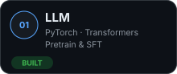
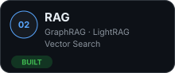
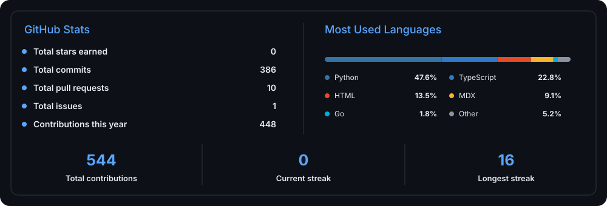

### ◇ Tech Stack

  

### ◈ Learning Journey

  
  
  
  

### ▣ Featured Projects

#### Applications

<table width="100%">
<tbody>
<tr>
<td width="50%" valign="top">

<h3>
  
  &nbsp;<a href="https://github.com/Ariasu123/Tinyllm">TinyLLM</a>
</h3>

A 54M Chinese language model trained from scratch with native PyTorch, covering dense pretraining and full SFT.

  
  
  
  
  

</td>
<td width="50%" valign="top">

<h3>
  
  &nbsp;<a href="https://github.com/Ariasu123/Pion">Pion</a>
</h3>

A lightweight, extensible terminal coding agent with tools, sessions, hooks, MCP, and optional Docker sandboxing.

  
  
  
  
  

</td>
</tr>
</tbody>
<tbody>
<tr>
<td colspan="2" width="100%" valign="top">

<h3>
  
  &nbsp;<a href="https://github.com/Ariasu123/Nano-vLLM-Ext">Nano-vLLM-Ext</a>
</h3>

A lightweight inference engine extended with speculative decoding, chunked prefill, fair scheduling, and enhanced prefix caching.

  
  
  
  
  
  

</td>
</tr>
</tbody>
</table>

### ◫ Development Metrics

  

